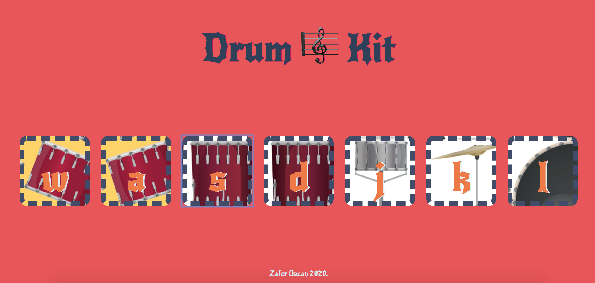

# Play-Drum-Kit
Play drum kit with mouse click and keyboard

# Project Outcomes
<li> Adding Event Listener to a button </li>
<li> How to play sound on a website </li>
<li> How to use Switch Statement in Javascript </li>
<li> A Deeper Understanding of
Javascript Objects</li>
<li> Objects, their Methods and the Dot
Notation</li>
<li> Using Keyboard Event Listeners to
Check for Key Presses </li>
<li> Understanding Callbacks and How
to Respond to Events </li>
<li> Adding Animation to Websites </li>

Requirements:

Install
$ git clone 
$ cd PROJECT

Languages & tools
HTML
JavaScript
CSS
